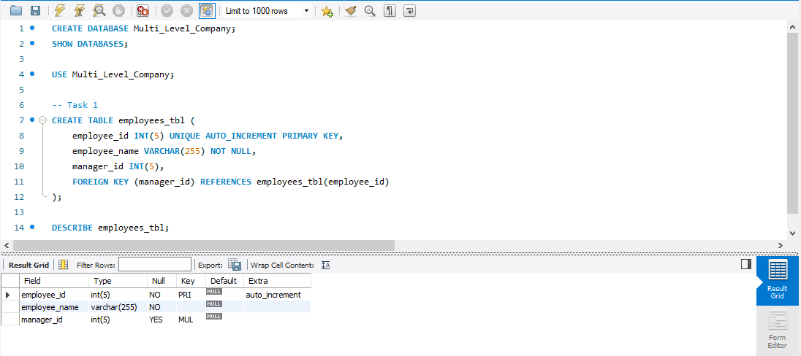
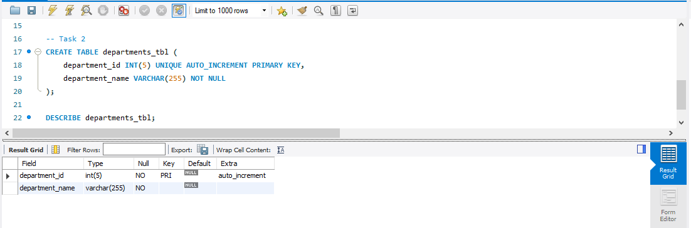
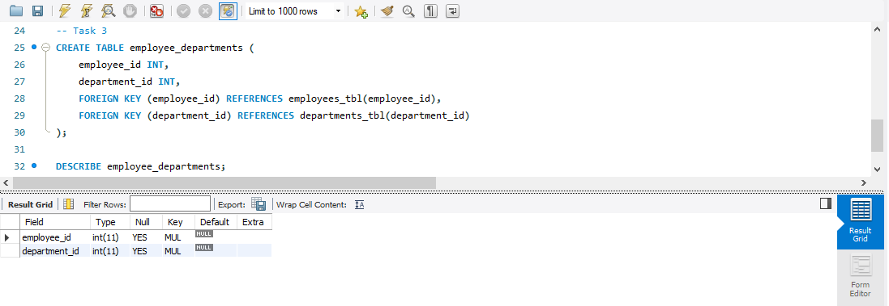
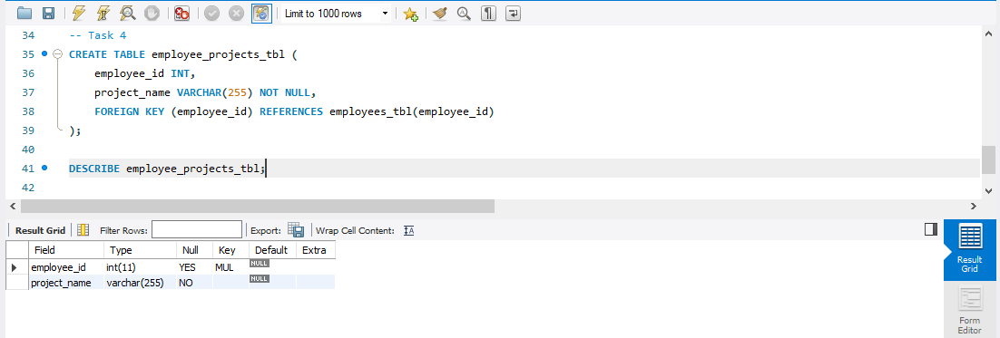
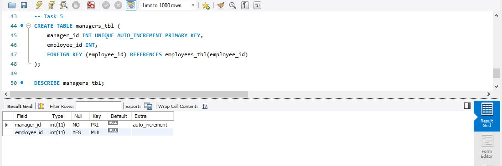

# Company Database Schema
This project contains a basic relational database design for managing employee-related information in a company.
It includes employees, departments, managers, and their relationships with projects and departments.
---

## Database: Multi_level_Company

### employees

This table stores employee records and their managers.

CREATE TABLE employees_tbl (
    employee_id INT(5) UNIQUE AUTO_INCREMENT PRIMARY KEY,
    employee_name VARCHAR(255) NOT NULL,
    manager_id INT(5),
    FOREIGN KEY (manager_id) REFERENCES employees_tbl(employee_id)
    );
### EMPLOYEES Table Structure

---

### Departments Table

This table contains information about each department within the company.

CREATE TABLE departments_tbl (
    department_id INT(5) UNIQUE AUTO_INCREMENT PRIMARY KEY,
    department_name VARCHAR(255) NOT NULL
);

### DEPARTMENTS Table Structure

---

### Employee_Departments Table

This table links employees to their departments, establishing many-to-many relationships.

CREATE TABLE employee_departments (
    employee_id INT,
    department_id INT,
    FOREIGN KEY (employee_id) REFERENCES employees_tbl(employee_id),
    FOREIGN KEY (department_id) REFERENCES departments_tbl(department_id)
);

### EMPLOYEES_DEPARTMENTS Table Structure

---

### Task 4: Employee_Projects Table
This table keeps track of projects assigned to each employee.

CREATE TABLE employee_projects_tbl (
    employee_id INT,
    project_name VARCHAR(255) NOT NULL,
    FOREIGN KEY (employee_id) REFERENCES employees_tbl(employee_id)
);

### EMPLOYEES_PROJECTS Table Structure

---

### Task 5: Managers Table
This table stores manager information, linking them back to employee records.

CREATE TABLE managers_tbl (
    manager_id INT UNIQUE AUTO_INCREMENT PRIMARY KEY,
    employee_id INT,
    FOREIGN KEY (employee_id) REFERENCES employees_tbl(employee_id)
);

### MANAGERS Table Structure

