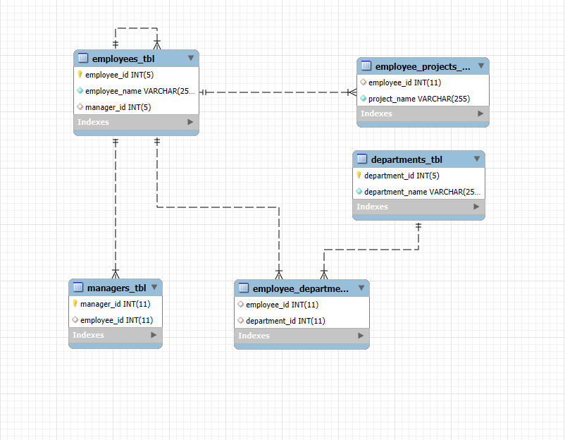

# Multi Level Company Database 
This project contains a basic relational database design for managing employee-related information in a company.
It includes employees, departments, managers, and their relationships with projects and departments.
---

## Database: Multi_level_Company

### employees

This table stores employee records and their managers.
### EMPLOYEES Table Structure

---

### Departments Table

This table contains information about each department within the company.
### DEPARTMENTS Table Structure

---

### Employee_Departments Table

This table links employees to their departments, establishing many-to-many relationships.
### EMPLOYEES_DEPARTMENTS Table Structure

---

### Task 4: Employee_Projects Table
This table keeps track of projects assigned to each employee.
### EMPLOYEES_PROJECTS Table Structure

---

### Task 5: Managers Table
This table stores manager information, linking them back to employee records.
### MANAGERS Table Structure

### EER Diagram
This diagram shows a visual representation of the relationships among the tables.

