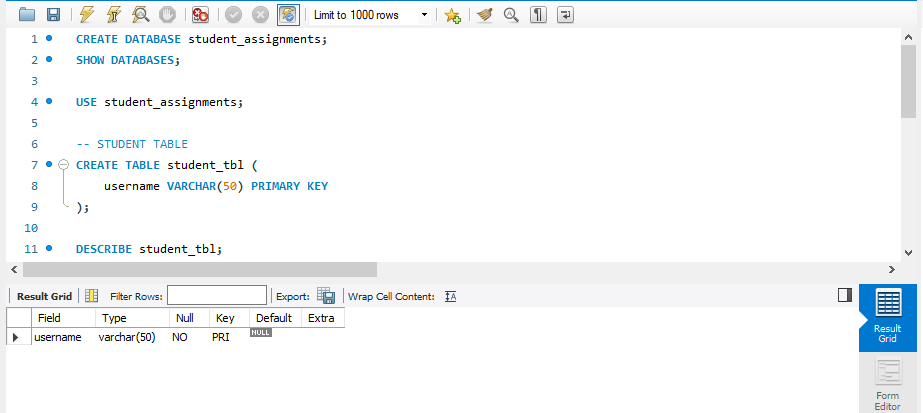
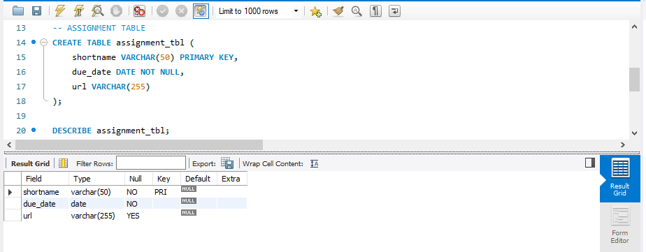
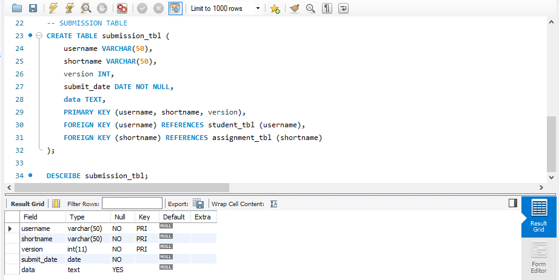
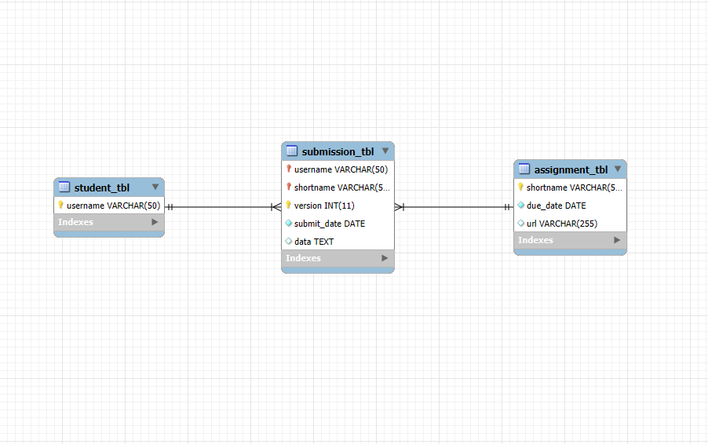

# Finals Lab Task 2: Transforming ER Model to Relational Tables
For this task, we are given an ER diagram representing student assignment submissions, which we need to convert into MySQL tables.

## Here’s the Query Statements

Fisrt, a command that create a database, so subsequent SQL operations will be performed within that specific database.
```sql
CREATE DATABASE student_assignments;
SHOW DATABASES;

USE student_assignments;
```
### Student Query Statements
```sql
CREATE TABLE student_tbl (
    username VARCHAR(50) PRIMARY KEY
);
```
### Assignment Query Statements
```sql
CREATE TABLE assignment_tbl (
    shortname VARCHAR(50) PRIMARY KEY,
    due_date DATE NOT NULL,
    url VARCHAR(255)
);
```
### Submission Query Statements
```sql
CREATE TABLE submission_tbl (
    username VARCHAR(50),
    shortname VARCHAR(50),
    version INT,
    submit_date DATE NOT NULL,
    data TEXT,
    PRIMARY KEY (username, shortname, version),
    FOREIGN KEY (username) REFERENCES student_tbl (username),
    FOREIGN KEY (shortname) REFERENCES assignment_tbl (shortname)
);
```

Here's the screenshot of Table Structure (See screenshots)

### Student Table

  


### Assignment Table

  


### Submission Table

  


### ER Diagram or Relational Schema


